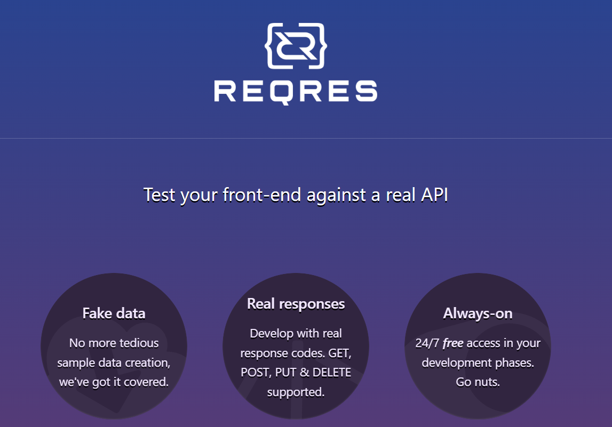
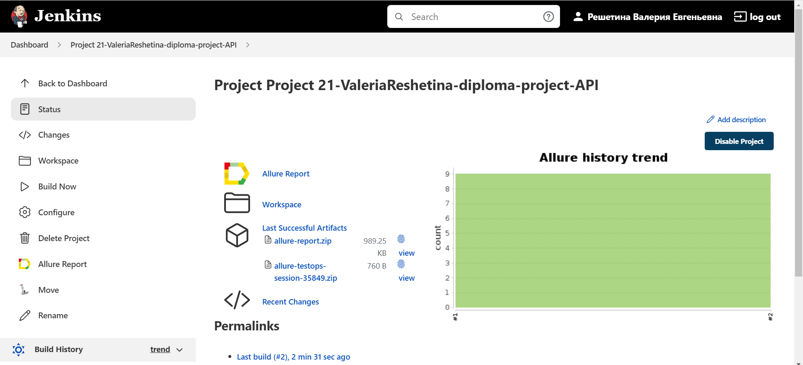
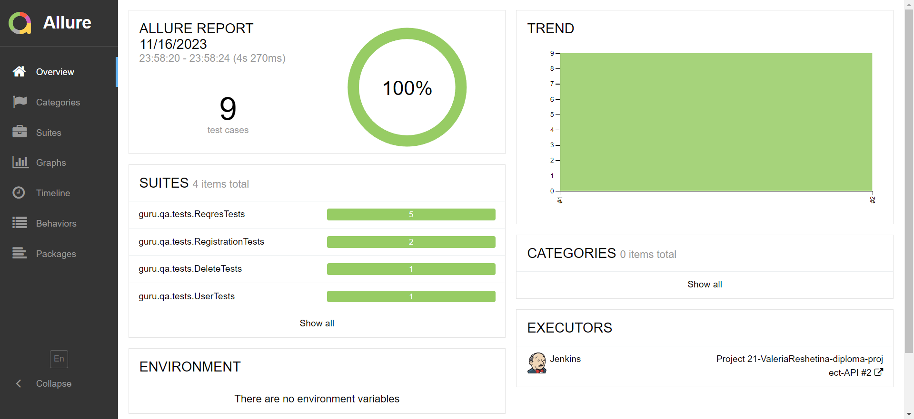
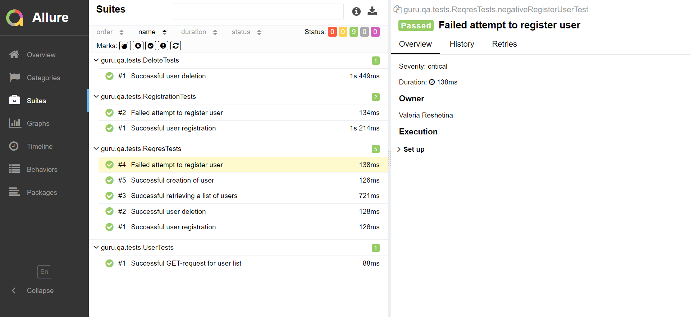
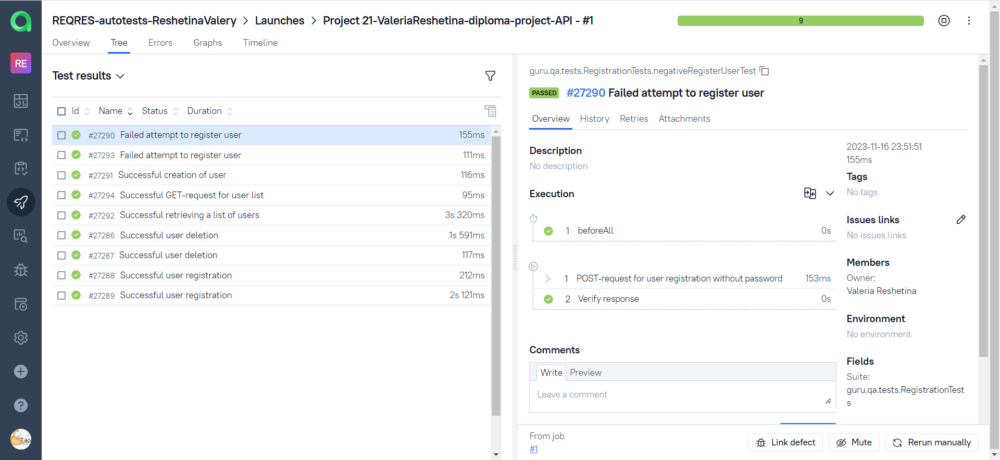
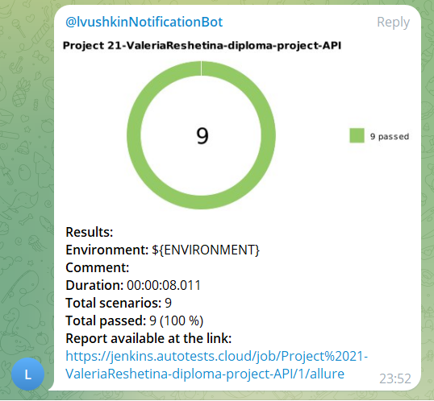

## Project with API-tests for [REQRES](https://reqres.in/api)

<p>
  
</p>

## Content

- [🛠️ Stack of technologies](#-stack-of-technologies)
- [📋 List of API tests](#-list-of-api-tests)
- [🔌 Running tests from the terminal](#-running-tests-from-the-terminal)
- [🔧 Property files](#-property-files)
- [⚙️ Running tests in Jenkins](#-running-tests-in-jenkins)
- [📊 Test results report in Allure Report](#-test-results-report-in-allure-report)
- [🚀 Integration with Allure TestOps](#-integration-with-allure-testops)
- [📣 Integration with Telegram](#-telegram-notifications-using-a-bot)

## 🛠️ Stack of technologies

<div style="text-align: center;">


</div>

## 📋 List of API Tests

- [x] Successful user registration
- [x] Successful user deletion
- [x] Successful user creation
- [x] Failed attempt to register user without password
- [x] Successful retrieving of user list

## 🔌 Running tests from the terminal

### Running tests locally:

```bash
gradle clean test
```

##  Running tests in [Jenkins](https://jenkins.autotests.cloud/job/Project%2021-ValeriaReshetina-diploma-project-API/)

#### To execute the tests in Jenkins, you need to click `Build Now`:

#### Main page of the build:

<div style="text-align: center;">
  
</div>

##  Test results report in [Allure Report](https://jenkins.autotests.cloud/job/21-ValeriaReshetina-diploma-project-UI/allure/)

####  It is possible to switch from <code><strong>Jenkins</strong></code> to reports generated by <code><strong>Allure</strong></code>.

<div style="text-align: center;">
  
</div>

###  Allure dashboard with statistics

<div style="text-align: center;">
  
</div>

### Grouping of tests by checked functionality

<div style="text-align: center;">
  
</div>

##  Integration with [Allure TestOps](https://allure.autotests.cloud/launch/32151)
#### Integration of <code><strong>Allure TestOps</strong></code> with <code><strong>Jenkins</strong></code>  allows you to run several custom tests and monitor their execution online.

<div style="text-align: center;">
  
</div>

##  Telegram notifications using a bot

####  After passing all the tests, an automatic report is sent to the <code>Telegram Notification Bot</code>.

<div style="text-align: center;">
    
</div>

[Back to content](#content)
